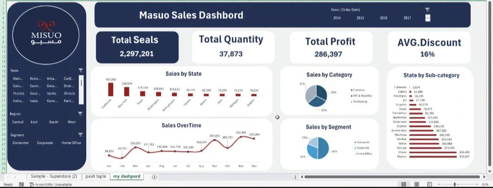

# 📊 Masuo Sales Performance & Business Intelligence Dashboard

## 📌 Project Overview
This project is a comprehensive data analysis and business intelligence case study built to analyze Masuo’s sales performance across multiple dimensions including states, categories, customer segments, and time periods.

The main objective of this project is to transform raw sales data into actionable insights that help improve business performance, optimize profitability, and support strategic decision-making.

This dashboard simulates a real-world retail analytics environment where data is used to uncover performance gaps, understand customer behavior, and identify growth opportunities.

---

## ❗ Business Problem

Before this analysis, Masuo faced several critical challenges:

- Lack of visibility into overall sales performance  
- Difficulty identifying profitable vs non-profitable products  
- No clear understanding of state-level performance differences  
- Weak tracking of sales trends over time  
- Inefficient discount strategy affecting profit margins  
- Limited insight into customer segmentation performance  
- No structured analysis for category and sub-category contribution  

These issues limited the company’s ability to make data-driven decisions and optimize revenue.

---

## 🛠️ My Role & What I Did

In this project, I worked as a Data Analyst responsible for converting raw sales data into meaningful business intelligence.

### 🔹 Data Preparation
- Cleaned and structured raw sales dataset  
- Handled missing values and inconsistencies  
- Standardized categories, states, and customer segments  

### 🔹 Data Analysis
- Performed exploratory data analysis (EDA)  
- Identified high and low performing categories  
- Analyzed sales and profit trends over time  
- Evaluated discount impact on profitability  
- Studied state-wise and segment-wise performance  
- Analyzed sub-category contribution to total revenue  

### 🔹 Dashboard Development
- Built an interactive and dynamic BI dashboard  
- Designed KPI-driven visual analytics system  
- Created multi-dimensional analysis views  
- Ensured clarity for business decision-makers  

---

## 📊 Key Performance Indicators (KPIs)

1. Total Sales  
2. Total Quantity  
3. Total Profit  
4. Average Discount  
5. Sales by State  
6. Sales Over Time  
7. Sales by Category  
8. Sales by Segment  
9. State by Sub-Category  

---

## 📈 Business Insights & Findings

### 🔴 Key Problems Identified
- Certain states contribute significantly more revenue than others  
- Some categories generate high sales but lower profit margins  
- Discounts are impacting profitability in specific segments  
- Sales performance fluctuates strongly over time  
- Sub-category performance is uneven across states  

---

### 🟢 Opportunities Discovered
- Focus on high-performing states can maximize revenue  
- Optimizing discount strategy can improve profit margins  
- Weak categories can be improved or repositioned  
- Seasonal trends can be used for better planning  
- High-performing sub-categories can be scaled further  

---

## 🚀 Business Impact

This analysis provided Masuo with strong business intelligence insights that directly improve decision-making:

- 📊 Clear visibility into sales, profit, and quantity performance  
- 💡 Better understanding of customer segmentation behavior  
- 📉 Identification of profit leakage due to discount strategy  
- 📈 Improved product and category performance analysis  
- 🎯 Strong data-driven foundation for strategic planning  

### 💰 Expected Business Improvements:
- Increase in profit through optimized discount control  
- Higher revenue through focus on top-performing states  
- Better inventory and sales planning  
- Improved category performance optimization  
- More efficient segmentation targeting strategy  

---

## 🛠️ Tools & Technologies Used
- Power BI / Tableau  
- Microsoft Excel  
- Data Cleaning & Transformation  
- Data Visualization & Business Intelligence  

---

## 📊 Dashboard Preview

---

## 🎯 Final Conclusion

This project demonstrates how raw retail data can be transformed into powerful business intelligence.

By analyzing Masuo’s sales from multiple perspectives — states, categories, segments, and time — this project delivers actionable insights that improve profitability, optimize strategy, and support smarter decision-making.

---

## 🔥 Key Takeaway
Data is the backbone of smart business decisions.  
This dashboard transforms Masuo’s raw data into a clear roadmap for growth and efficiency.
